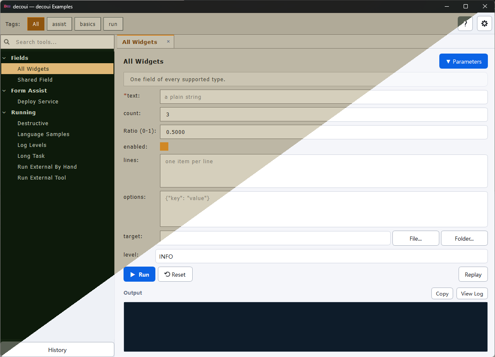
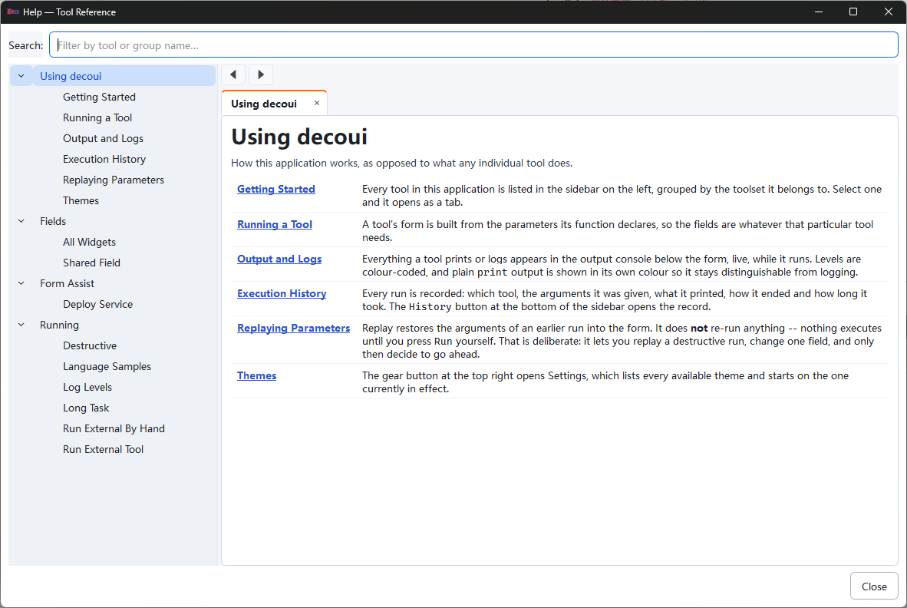
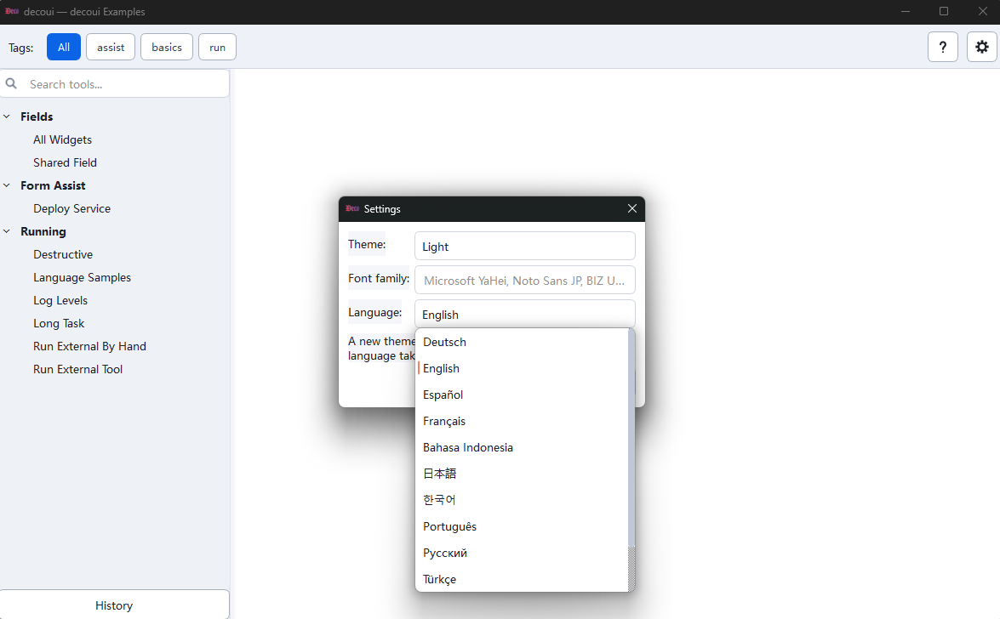

<div align="center">
  <p><a href="README.md">English</a> · <a href="README-ZH-CN.md">简体中文</a> · <strong>日本語</strong> · <a href="README-KR.md">한국어</a></p>
  
  <h1>decoui</h1>
  <p><strong>Python メソッドにアノテーションを付けるだけで、そのまま使えるネイティブデスクトップツールに。</strong></p>
  <p>Decorator-driven GUI framework for Python · Built with PySide6</p>

  <p>
    <a href="https://pypi.org/project/decoui/"></a>
    
    <a href="LICENSE"></a>
  </p>
</div>

decoui は、関数シグネチャをフォームに、実行内容をリアルタイムログに、そして実行結果を追跡可能な履歴に変換します。開発者は Python のビジネスロジックに集中するだけ。Qt ウィンドウ、バックグラウンド実行、履歴、再実行、設定、ヘルプシステムは decoui が用意します。



## decoui でできること

| コードからデスクトップツールまで | decoui が提供するもの |
|---|---|
| **① アノテーション** | 既存の Python メソッドを `@toolset`、`@tool`、型アノテーションで定義します。 |
| **② 収集** | ツールセットを自動検出するか、`toolsets=[...]` で明示的に指定します。 |
| **③ 起動** | 検索可能なサイドバー、タグフィルター、複数のツールタブ、共通設定画面を自動生成します。 |
| **④ 入力** | Python の型をネイティブウィジェットに変換し、必要に応じて自動補完、連動入力、遅延デフォルト値を追加します。 |
| **⑤ 記録** | 処理をバックグラウンドで実行し、`print` と `logging`、パラメーター、状態を保存して、過去の入力を再利用できます。 |
| **⑥ 配布** | テーマ、i18n、収集されたヘルプを組み合わせ、社内スクリプトを実用的なデスクトップアプリとして届けられます。 |

## ヘルプと多言語対応を、最初から

### docstring がそのままユーザー向けヘルプになる

**メソッドの説明は一度書くだけ。** decoui が docstring を自動収集し、概要、パラメーター、戻り値、例外、相互参照を備えた、検索・ナビゲーション可能なヘルプページを生成します。

<p align="center">
  
</p>

### ひとつの画面を、ユーザーの言語で

**言語を UI に固定する必要はありません。** i18n でインターフェース言語を選び、アプリ独自のラベル、フィールド、説明、ヘルプをカタログで設定できます。UI を作り直す必要はありません。

<p align="center">
  
</p>

## 単なる「フォーム生成」ではありません

- **テーマ（Themes）** — Light、Cockpit、Mission Control、Industrial 1980s の 4 種類を標準搭載。JSON で拡張・上書きでき、実行中のツールを止めずにテーマを切り替えられます。
- **国際化（i18n）** — decoui 自体のインターフェース用カタログを同梱。ツールのラベル、フィールド、説明、ヘルプにもアプリ独自の翻訳カタログを利用できます。
- **ヘルプの自動収集** — docstring から概要、パラメーター表、戻り値、例外の説明を生成します。長文の Markdown やヘルプページ間の相互参照にも対応します。
- **信頼性の高い実行** — バックグラウンドスレッド、進捗表示、タイムアウト、キャンセル、子プロセス出力のストリーミングに対応します。
- **履歴と再実行（History & Replay）** — すべての実行を SQLite に保存し、履歴の絞り込み、完全なログの確認、過去のパラメーター復元をアプリ内で行えます。

## 30 秒で始める

```bash
pip install decoui
```

Python 3.10 以降が必要です。標準では軽量な `PySide6-Essentials` のみに依存し、完全な `PySide6-Addons` はインストールしません。

```python
import logging

from decoui import gui_main, tool, toolset


@toolset(label="Text Tools", tags=["text"])
class TextTools:
    @tool(
        label="Count Characters",
        description="Count characters, words, and lines.",
        placeholders={"content": "Paste text here..."},
    )
    def count(self, content: str = "") -> None:
        words = len(content.split())
        logging.info("%d chars / %d words", len(content), words)


if __name__ == "__main__":
    gui_main(title="My Tools")
```

ファイルを実行するだけです。`gui_main()` が呼び出し元の名前空間にあるすべての `@toolset` を検出し、完全なアプリケーションを構築します。

```bash
python app.py
```

## 型がそのままフォームになる

| Python の型 | 生成されるコントロール |
|---|---|
| `str` | 1 行テキストフィールド |
| `int` / `float` | 数値入力 |
| `bool` | チェックボックス |
| `list` / `dict` | 複数行エディター |
| `Enum` | ドロップダウン |
| `pathlib.Path` | ファイル／フォルダ選択ボタン付きパス入力 |

`completions`、`cascade`、`defaults` を使えば、自動補完、連動フィールド、実行時デフォルト値を追加できます。元のメソッドは通常の Python のままなので、GUI を使わず直接呼び出してテストできます。

## ドキュメント

詳細情報は README から分離されています。目的に応じて必要なガイドを参照してください。

- [API・動作仕様リファレンス](docs/reference.md) — デコレーター、型マッピング、フォーム補助、テーマ、ストレージ、履歴など
- [起動ライフサイクル](docs/startup-lifecycle.md) — 初期化順序、データ読み込み、エラー処理
- [アプリケーションの翻訳](docs/translating-an-application.md) — ツールの文言と長文ヘルプのローカライズ
- [ヘルプの作成](docs/help-authoring.md) — docstring、Markdown、相互参照
- [キャンセルと子プロセス](docs/cancelling-a-run.md) — Stop、タイムアウト、クリーンアップの正しい実装
- [設計と実装](docs/design.md) — モジュール構成、実行エンジン、ストレージ、UI アーキテクチャ

すべての対応機能を確認できるサンプルは [`src/decoui/example/`](src/decoui/example/) にあります。次のコマンドで実行できます。

```bash
python -m decoui.example
```

## 向いている用途

データ処理ツール、運用ユーティリティ、バッチジョブのランチャー、社内向け業務ツール、非開発者に渡す Python スクリプトなど。特に「ビジネスロジックはすでにあり、信頼できるデスクトップ入口だけが必要」というプロジェクトに適しています。

> decoui は現在 Alpha 段階です。実際の利用で見つかった問題やフィードバックは [GitHub Issues](https://github.com/luvmagi/decoui/issues) までお寄せください。

## ライセンス

[Apache-2.0](LICENSE)
