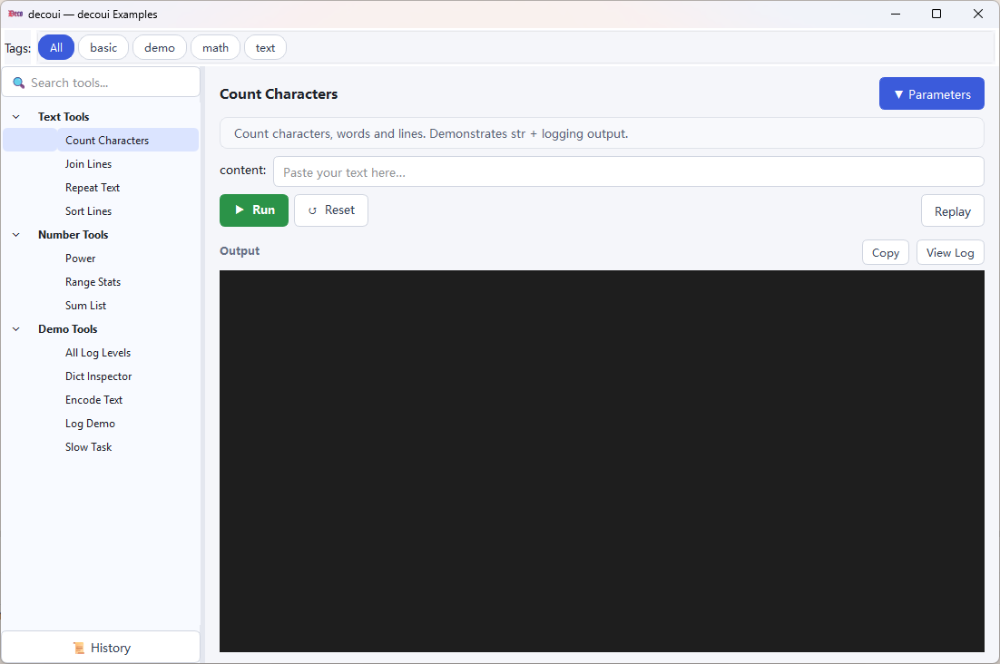

# decoui

Decorator-driven GUI framework for Python. Annotate your methods — decoui generates a full PySide6 desktop app automatically.



---

## Features

- **Zero UI code** — decorate a class and its methods, call `gui_main()`
- **Native type mapping** — `str`, `int`, `float`, `bool`, `list`, `dict`, `Enum` → widgets automatically
- **Async execution** — every tool runs in a thread; stdout and `logging` are captured in real time
- **Execution history** — every run is persisted to SQLite with parameters, logs, and status
- **Replay** — restore any past run's parameters with one click
- **Light theme** — clean built-in stylesheet, Consolas / 微软雅黑 / Meiryo font stack

---

## Installation

```bash
pip install decoui
```

Requires Python 3.10+ and PySide6 6.6+.

---

## Quick Start

```python
import logging
from decoui import tool, toolset, gui_main

@toolset(label="Text Tools", tags=["text"])
class TextTools:

    @tool(label="Count Characters",
          description="Count chars, words and lines.",
          placeholders={"content": "Paste text here…"})
    def count(self, content: str = "") -> str:
        words = len(content.split())
        logging.info("words=%d", words)
        return f"{len(content)} chars / {words} words"

if __name__ == "__main__":
    gui_main(title="My Tools")
```

`gui_main()` auto-discovers every `@toolset` class in the caller's global scope — no explicit registration needed.

---

## API Reference

### `@toolset`

Applied to a class. Groups its `@tool` methods under one sidebar entry.

```python
@toolset(
    label="CSV Tools",           # required — sidebar display name
    tags=["file", "batch"],      # optional — used by the tag filter bar
    description="...",           # optional — tooltip on hover in the sidebar
)
class CsvTools:
    ...
```

| Parameter | Type | Description |
|---|---|---|
| `label` | `str` | Required. Display name in the sidebar. |
| `tags` | `list[str]` | Tag filter bar labels. Multiple tags = AND filter. |
| `description` | `str` | Shown as a tooltip when hovering the toolset in the nav tree. |

### `@tool`

Applied to a method inside a `@toolset` class.

```python
@tool(
    label="Merge Files",
    description="Merge multiple files into one.",
    placeholders={"files": "one path per line"},
    confirm=True,     # show confirmation dialog before running
    timeout=120,      # cancel after N seconds (None = unlimited)
)
def merge(self, files: list, output: str = "out.txt") -> str:
    ...
```

| Parameter | Type | Default | Description |
|---|---|---|---|
| `label` | `str` | required | Tool display name. |
| `description` | `str` | `""` | Shown in a bordered box below the title. |
| `placeholders` | `dict[str,str]` | `{}` | Placeholder text per parameter name. |
| `confirm` | `bool` | `False` | Show a Yes/No confirmation dialog before running. |
| `timeout` | `int\|None` | `None` | Execution timeout in seconds. |

### `gui_main`

```python
gui_main(title="My App", db_path="~/.myapp/history.db")
```

| Parameter | Type | Default | Description |
|---|---|---|---|
| `title` | `str` | `"decoui"` | Window title. |
| `db_path` | `str\|Path\|None` | `~/.decoui/history.db` | SQLite database path for execution history. |

---

## Type → Widget Mapping

| Python annotation | Widget | Notes |
|---|---|---|
| `str` | `QLineEdit` | Single-line text. |
| `int` | `QSpinBox` | Integer, full int range. |
| `float` | `QDoubleSpinBox` | 4 decimal places. |
| `bool` | `QCheckBox` | Checked / unchecked. |
| `list` | `QTextEdit` | One item per line or comma-separated. |
| `dict` | `QTextEdit` | JSON input; parsed with `json.loads` then `ast.literal_eval`. Raises on invalid input. |
| `Enum` subclass | `QComboBox` | Dropdown of enum members. |

- Required parameters (no default) are marked with a red `*` in the form label.
- `Optional[X]` is unwrapped to `X`.
- Default values are pre-filled into widgets automatically.

---

## Output & Logging

Tool methods can use `print()` and the standard `logging` module. Both are captured and rendered in the output console with colour coding:

| Source | Colour |
|---|---|
| `print` / stdout | White |
| `logging.DEBUG` | Gray |
| `logging.INFO` | Cyan |
| `logging.WARNING` | Yellow |
| `logging.ERROR` | Red |
| `logging.CRITICAL` | Bold Red |

Return values from tool methods are **not** displayed in the GUI. Use `logging` or `print` for any output you want users to see.

---

## Tool Page Buttons

| Button | Action |
|---|---|
| **Run** | Type-coerce parameters, run the method in a background thread. |
| **Reset** | Expand the parameter panel and clear the output console. Parameters are kept. |
| **Stop** | Request cancellation of the running task. |
| **Replay** | Open the History panel pre-filtered to this tool's past runs. |
| **Copy** | Copy current console output to clipboard. |
| **View Log** | Open the current console output in a resizable log viewer window. |

---

## Execution History

Every run is stored in SQLite. The History panel (sidebar button) shows:

- Timestamp, tool name, status badge, duration
- Per-row checkboxes with **Select All / Deselect All / Delete Selected**
- Filter by tool, status, and time range
- Click any row to see the parameter snapshot
- **Replay Params** — restores that run's parameters to the tool's form
- **View Full Log** — opens the full log in a resizable window with level filters and search

History is stored at `~/.decoui/history.db` by default. Override with `db_path` in `gui_main()`.

---

## Example

See [`src/decoui/example.py`](src/decoui/example.py) for a complete demo covering all supported widget types.

Run it with:

```bash
uv run python main.py
# or
python main.py
```
