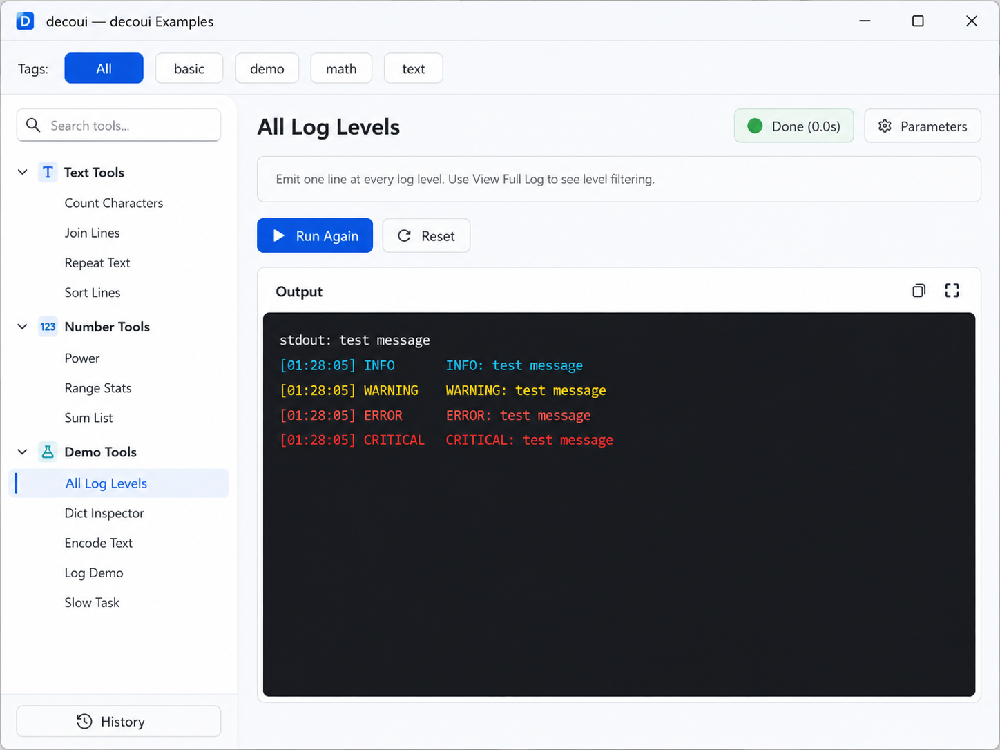

# decoui

Decorator-driven GUI framework for Python. Annotate your methods — decoui generates a full PySide6 desktop app automatically.



---

## Features

- **Zero UI code** — decorate a class and its methods, call `gui_main()`
- **Native type mapping** — `str`, `int`, `float`, `bool`, `list`, `dict`, `Enum` → widgets automatically
- **Form assist** — autocomplete, cascading fill, and lazily evaluated defaults
- **Async execution** — every tool runs in a thread; stdout and `logging` are captured in real time
- **Execution history** — every run is persisted to SQLite with parameters, logs, and status
- **Parallel tool tabs** — keep multiple tool pages open and switch between running tasks
- **Persistent layout** — sidebar width is restored from the application database
- **Replay** — restore any past run's parameters with one click
- **Light theme** — clean built-in stylesheet, Consolas / 微软雅黑 / Meiryo font stack

---

## Installation

```bash
pip install decoui
```

Requires Python 3.10+.

decoui depends on **`PySide6-Essentials`** (6.6+), not the full `PySide6` metapackage.
It only ever imports `QtCore`, `QtGui`, `QtWidgets` and `QtTest`, all of which live in
Essentials — so the extra `PySide6-Addons` payload (Charts, Multimedia, WebEngine,
Qt3D, …) is skipped. Measured on Windows / PySide6 6.11: **637 MB → 202 MB**.

If your own tool methods need an Addons module, depend on it explicitly:

```bash
pip install decoui PySide6-Addons   # or simply: pip install decoui PySide6
```

Both coexist with decoui — `PySide6` is just `PySide6-Essentials` + `PySide6-Addons`.

> **Upgrading an existing environment** — all three distributions unpack into the same
> `PySide6/` directory, so uninstalling `PySide6` / `PySide6-Addons` also deletes shared
> libraries that Essentials still needs, leaving `ImportError: DLL load failed while
> importing QtWidgets`. Force a clean reinstall rather than relying on the uninstall:
>
> ```bash
> pip install --force-reinstall PySide6-Essentials
> # uv: uv sync --reinstall-package pyside6-essentials
> ```
>
> Fresh installs are unaffected.

---

## Quick Start

```python
import logging
from decoui import tool, toolset, gui_main

@toolset(label="Text Tools", tags=["text"])
class TextTools:

    @tool(label="Count Characters",
          description="Count chars, words and lines.",
          placeholders={"content": "Paste text here…"})
    def count(self, content: str = "") -> str:
        words = len(content.split())
        logging.info("words=%d", words)
        return f"{len(content)} chars / {words} words"

if __name__ == "__main__":
    gui_main(title="My Tools")
```

`gui_main()` auto-discovers every `@toolset` class in the caller's global scope — no explicit registration needed.

---

## API Reference

### `@toolset`

Applied to a class. Groups its `@tool` methods under one sidebar entry.

```python
@toolset(
    label="CSV Tools",           # required — sidebar display name
    tags=["file", "batch"],      # optional — used by the tag filter bar
    description="...",           # optional — tooltip on hover in the sidebar
)
class CsvTools:
    ...
```

| Parameter | Type | Description |
|---|---|---|
| `label` | `str` | Required. Display name in the sidebar. |
| `tags` | `list[str]` | Tag filter bar labels. Multiple tags = AND filter. |
| `description` | `str` | Shown as a tooltip when hovering the toolset in the nav tree. |

### `@tool`

Applied to a method inside a `@toolset` class.

```python
@tool(
    label="Merge Files",
    description="Merge multiple files into one.",
    placeholders={"files": "one path per line"},
    confirm=True,     # show confirmation dialog before running
    timeout=120,      # cancel after N seconds (None = unlimited)
)
def merge(self, files: list, output: str = "out.txt") -> str:
    ...
```

| Parameter | Type | Default | Description |
|---|---|---|---|
| `label` | `str` | required | Tool display name. |
| `description` | `str` | `""` | Shown in a bordered box below the title. |
| `placeholders` | `dict[str,str]` | `{}` | Placeholder text per parameter name. |
| `labels` | `dict[str,str]` | `{}` | Form label per parameter name. Defaults to the parameter name. |
| `confirm` | `bool` | `False` | Show a Yes/No confirmation dialog before running. |
| `timeout` | `int\|None` | `None` | Execution timeout in seconds. |
| `completions` | `dict[str,list\|callable\|str]` | `{}` | Autocomplete candidates per parameter. See [Form Assist](#form-assist). |
| `cascade` | `dict[str,callable\|str]` | `{}` | Fill other parameters when this one changes. |
| `defaults` | `dict\|callable\|str` | `None` | Initial form values, evaluated when the page opens. |
| `completion_debounce_ms` | `int` | `250` | Idle time before a dynamic completions callback runs. |

### `gui_main`

```python
gui_main(title="My App", db_path="~/.myapp/history.db", on_startup=connect_backend)
```

| Parameter | Type | Default | Description |
|---|---|---|---|
| `title` | `str` | `"decoui"` | Window title. |
| `db_path` | `str\|Path\|None` | `~/.decoui/history.db` | SQLite database path for execution history and application settings. |
| `on_startup` | `callable\|None` | `None` | Application-wide setup, run once before any toolset is created and before the window appears. See [Startup](#startup). |

### Startup

> Full guide: [docs/startup-lifecycle.md](docs/startup-lifecycle.md) — read it before loading anything at startup.

Startup runs in a fixed order, so anything loaded early is available later:

1. `db_path` is applied and the database is initialised
2. the toolset tree is built and validated
3. `gui_main(on_startup=...)` runs — application-wide work
4. **every `@toolset` class is instantiated**
5. **each instance's own `on_startup()` method runs**, if it defines one
6. the window is shown and the event loop starts

The recommended pattern is to **declare state in `__init__` and load it in `on_startup()`**:

```python
@toolset(label="Deploy Tools")
class DeployTools:

    def __init__(self):
        self.config = {"env": "staging"}          # declare, with fallbacks

    def on_startup(self):
        self.config = json.loads(                  # load, before the UI is live
            CONFIG_PATH.read_text(encoding="utf-8")
        )

    @tool(label="Deploy", defaults="load_defaults")
    def deploy(self, env: str = "") -> None:
        ...

    def load_defaults(self) -> dict:
        return {"env": self.config["env"]}         # reads self at call time
```

Splitting the two matters when loading fails: `__init__` still succeeded, so the toolset opens with its declared fallbacks instead of disappearing.

Use the `gui_main(on_startup=...)` argument for work that belongs to no single toolset — a shared connection, an auth token, a warm cache. It runs *before* any instance exists, so it cannot write to `self`; give the toolset its own `on_startup()` method for that. The application hook always runs before every toolset hook.

#### Two rules for both hooks

- **The event loop is not running yet.** `QTimer` does not fire, queued signals are not delivered, and `QThreadPool` results never arrive — waiting on a background thread here deadlocks startup. To report a problem, just `raise`; decoui shows it in a dialog once the window is up.
- **They block the window.** Both run synchronously before `show()`, so however long they take is time the user spends looking at nothing. Anything slow belongs in the tool body, where it gets a thread, a progress bar, and a Stop button.

#### Can the decorator see `self`?

Decorator **arguments** are evaluated at import time, when no instance exists — so this is impossible:

```python
@tool(label="Deploy", defaults={"env": self.config["env"]})   # NameError: self
```

Pass a **method name** instead. decoui resolves it to a bound method when the tool page is built, and the method reads `self` at call time — after `__init__` and `on_startup()` have run:

```python
@tool(label="Deploy",
      defaults="load_defaults",          # self.config is available inside
      completions={"service": "search_services"},
      cascade={"service": "describe_service"})
```

This works for `defaults`, `completions`, and `cascade` alike.

#### When startup fails

A failure in step 3, 4, or 5 **does not stop the application**. Every failure is collected and reported in one dialog over the main window, listing what failed with the full traceback behind the Details button, and everything that did load stays usable.

The one exception is step 4: a class whose `__init__` raises produces no object, so that toolset is skipped and its tools do not appear. That is the practical reason to keep `__init__` trivial and do the real loading in `on_startup()`.

---

## Type → Widget Mapping

| Python annotation | Widget | Notes |
|---|---|---|
| `str` | `QLineEdit` | Single-line text. |
| `int` | `QSpinBox` | Integer, full int range. |
| `float` | `QDoubleSpinBox` | 4 decimal places. |
| `bool` | `QCheckBox` | Checked / unchecked. |
| `list` | `QTextEdit` | One item per line or comma-separated. |
| `dict` | `QTextEdit` | JSON input; parsed with `json.loads` then `ast.literal_eval`. Raises on invalid input. |
| `Enum` subclass | `QComboBox` | Dropdown of enum members. |
| `pathlib.Path` | `QLineEdit` + buttons | Text field with **File...** (file picker) and **Folder...** (directory picker) buttons. The selected path is passed as a `pathlib.Path` to the method. |

- Required parameters (no default) are marked with a red `*` in the form label.
- `Optional[X]` is unwrapped to `X`.
- `Annotated[X, ...]` maps on `X`; the metadata does not affect widget choice.
- Default values are pre-filled into widgets automatically.

### Field metadata with `Annotated`

`F` attaches a label and placeholder to the type itself, so a field shared across
tools carries its wording with it instead of repeating it in every `@tool`:

```python
from pathlib import Path
from typing import Annotated
from decoui import F, tool, toolset

DumpFile = Annotated[Path, F(label="Dump file", placeholder="Pick a .dump / .tar")]

@toolset(label="Backup")
class Backup:

    @tool(label="Restore")
    def restore(self, archive: DumpFile) -> None: ...

    # One tool can reword the shared field; the decorator wins.
    @tool(label="Verify", labels={"archive": "Archive to check"})
    def verify(self, archive: DumpFile) -> None: ...
```

Resolution order for both label and placeholder:

`@tool(labels=…)` / `@tool(placeholders=…)` → `Annotated[…, F(…)]` → parameter name (label) or empty (placeholder)

Adding `F` to an annotation is purely additive: widget selection, required-field
marking and value conversion all read the bare type underneath, so existing code
keeps working unchanged.

> **Note** — with `from __future__ import annotations`, annotations are strings at
> runtime and decoui resolves them with `typing.get_type_hints()`. An alias like
> `DumpFile` must therefore be importable at runtime; putting the import under
> `if TYPE_CHECKING:` makes resolution fail, and decoui falls back to the raw
> strings, losing the `F` metadata along with the type mapping.

### `pathlib.Path` example

```python
import pathlib
from decoui import tool, toolset

@toolset(label="File Tools")
class FileTools:

    @tool(label="File Info", placeholders={"path": "Select a file or folder…"})
    def file_info(self, path: pathlib.Path) -> None:
        import logging
        p = pathlib.Path(path)
        logging.info("size: %d bytes", p.stat().st_size)
        logging.info("resolved: %s", p.resolve())
```

---

## Form Assist

Three opt-in `@tool` arguments make the parameter form react to what the user types.

```python
_CATALOG = {
    "web-frontend": {"version": "2.4.1", "owner": "frontend-team"},
    "auth-service": {"version": "3.0.2", "owner": "identity-team"},
}

@toolset(label="Deploy Tools")
class DeployTools:

    @tool(
        label="Deploy Service",
        completions={
            "env": ["production", "staging", "development"],   # static list
            "service": "search_services",                       # method on this class
        },
        cascade={"service": "describe_service"},                # fill other fields
        defaults={"env": "staging"},                            # initial values
    )
    def deploy(self, service: str = "", env: str = "",
               version: str = "", owner: str = "") -> None:
        ...

    def search_services(self, text: str) -> list[str]:
        return [name for name in _CATALOG if text.casefold() in name]

    def describe_service(self, value: str, form: dict) -> dict:
        return dict(_CATALOG.get(value, {"version": "", "owner": ""}))
```

### `completions` — autocomplete

| Value | Behaviour |
|---|---|
| `list[str]` | Fixed candidates, filtered by Qt (case-insensitive, substring match). |
| callable | Re-evaluated as the user types, debounced. The returned list replaces the popup contents; your callback controls matching and ordering. |
| `str` | Name of a method on the toolset class, so the callback can use `self`. |

Clicking into the field opens the popup right away, before anything is typed — a static list shows every option, and a callback is called with an empty `text` so it can return its default set. The list is not narrowed by a value already in the field, since re-entering one is usually a prelude to changing it.

Supported on `str` and `pathlib.Path` parameters only. Declaring it elsewhere raises at startup.

### `cascade` — fill other fields

Keyed by the **source** parameter. The callback returns `{target_name: value}`, or `None` to change nothing. It fires when the source is **committed** (focus loss, Enter, picking a candidate, toggling a checkbox), not on every keystroke, and is skipped when the value did not actually change.

Targets are always overwritten, including fields the user typed into — the callback receives `form` with every current value, so it can return one unchanged to preserve it. A written target may itself be a cascade source; chains are capped at 5 levels and cycles terminate after one round. **Replay never triggers cascades**, so restored parameters survive.

### `defaults` — lazy initial values

Signature defaults (`def deploy(self, env: str = "staging")`) are evaluated at **import** time. Use `defaults=` when the initial value must be read after the application has started — for example from `~/.decoui/history.db`, which does not exist until `gui_main()` runs.

```python
@tool(label="Deploy", defaults=lambda: {"env": get_setting("deploy.env", "staging")})
```

Accepts a dict, a callable taking nothing or the current `form`, or a method name. Runs once per tool page.

### Callback rules

- **Completion and cascade callbacks run on a background thread.** They must not touch Qt objects. Keep them to a lookup: query, return data.
- Callbacks may take 0, 1, or 2 positional arguments — `(text, form)` for completions, `(value, form)` for cascade.
- Any exception is caught, reported as a `WARNING` in the output console, and never aborts the form.
- Results from superseded requests are discarded, so a slow lookup cannot overwrite a newer one.

---

## Output & Logging

Tool methods can use `print()` and the standard `logging` module. Both are captured and rendered in the output console with colour coding:

| Source | Colour |
|---|---|
| `print` / stdout | White |
| `logging.DEBUG` | Gray |
| `logging.INFO` | Phosphor Green |
| `logging.WARNING` | Yellow |
| `logging.ERROR` | Red |
| `logging.CRITICAL` | Bold Red |

Return values from tool methods are **not** displayed in the GUI. Use `logging` or `print` for any output you want users to see.

---

## Tool Page Buttons

| Button | Action |
|---|---|
| **Run** | Type-coerce parameters, run the method in a background thread. |
| **Reset** | Expand the parameter panel and clear the output console. Parameters are kept. |
| **Stop** | Request cancellation of the running task. |
| **Replay** | Open the History panel pre-filtered to this tool's past runs. |
| **Copy** | Copy current console output to clipboard. |
| **View Log** | Open the current console output in a resizable log viewer window. |

---

## Execution History

Every run is stored in SQLite. The History panel (sidebar button) shows:

- Timestamp, tool name, status badge, duration
- Per-row checkboxes with **Select All / Deselect All / Delete Selected**
- Filter by tool, status, and time range
- Click any row to see the parameter snapshot
- **Replay Params** — restores that run's parameters to the tool's form
- **View Full Log** — opens the full log in a resizable window with level filters and search
- **DB size readout** — the current on-disk size of the history database, next to the filters
- **Clear History** — drops every record, parameter, and log, then vacuums the database to reclaim
  the space. Application settings are preserved.

History is stored at `~/.decoui/history.db` by default. Override with `db_path` in `gui_main()`.

---

## Example

See [`src/decoui/example.py`](src/decoui/example.py) for a complete demo covering all supported widget types.

Run it with:

```bash
uv run python main.py
# or
python main.py
```
